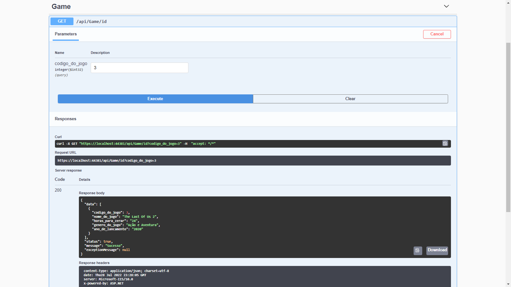
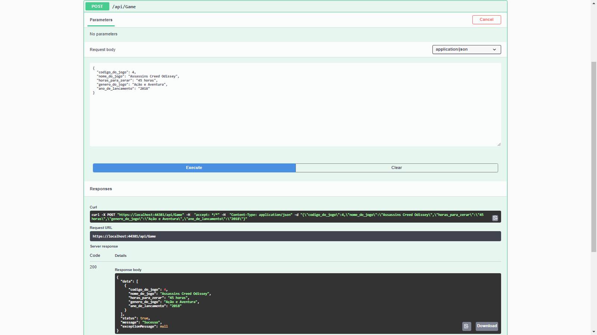

# API-Core-Games

# Descrição
Este projeto consiste na criação de uma API Core. 
Foi criada uma aplicação ASP Net Core Web API .net 5.0 utilizando:
<ul>
  <li>Swagger para implementação de uma interface que permita testar a aplicação e documentar a API.</li>
  <li>Biblioteca AutoMapper para fazer o mapeamento das classes.</li>
  <li>Repositórios genéricos para deixar o código melhor estruturado.</li>
  <li>Banco de dados MySql.</li>
  <li>Métodos Http: Get e Post para manipular os dados.</li>
</ul>
  
Através desta API podemos:

<ul>
  <li>Buscar os dados de um game específico pelo seu Id.</li>
  <li>Adicionar novos dados de games ao banco.</li>
</ul>

# Layout do Projeto

  
  
  

# Tecnologias Utilizadas

<ul>
  <li>C#</li>
  <li>.net 5.0</li>
  <li>Swagger</li>
  <li>Visual Studio 2019</li>
  <li>MySql Workbench</li>
  </ul>

# Autor
José Ricardo Chies Gonçalves

LinkedIn:
https://www.linkedin.com/in/ricardo-chies-087557216/

E-mail:
chies.dev@gmail.com
