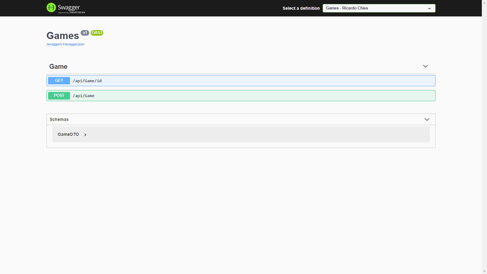

# Web-API-Games

# Descrição
Este projeto consiste na criação de uma Web API. 
Foi criada uma aplicação: 
ASP Net Core Web API .net 5.0 utilizando Swagger para implementação de uma interface que permita testar a aplicação e documentar a API.
Conectando os dados com o banco de dados MySql.
Utilizando os métodos Http: Get, Post, Put e Delete para manipular os dados.

Através desta API podemos:

<ul>
  <li>Buscar todos os dados de games inseridos no banco.</li>
  <li>Buscar os dados de um game específico pelo seu Id.</li>
  <li>Adicionar novos dados de games ao banco.</li>
  <li>Atualizar os dados de um game.</li>
  <li>Deletar os dados de um game pelo seu Id.</li>
</ul>

# Layout do Projeto

  
  

# Tecnologias Utilizadas

<ul>
  <li>C#</li>
  <li>.net 5.0</li>
  <li>Swagger</li>
  <li>Visual Studio 2019</li>
  <li>MySql Workbench</li>
  </ul>

# Autor
José Ricardo Chies Gonçalves

LinkedIn:
https://www.linkedin.com/in/ricardo-chies-087557216/

E-mail:
chies.dev@gmail.com
